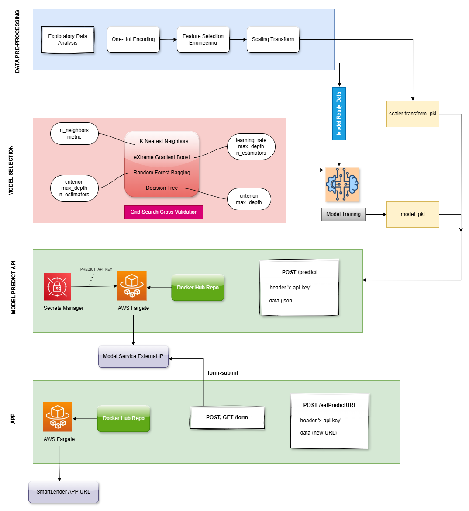

## SMART LENDER 
### A loan credibility analysis model to predict the credit worthiness of loan applicants.

Financial loan services are utilized by companies across various industries, including large banks, financial institutions, and government agencies. A key objective for organizations offering financial loan services is to reduce payment defaults and ensure that borrowers repay their loans as anticipated. To achieve this in an efficient and systematic manner, many companies leverage machine learning to predict which individuals are most at risk of defaulting on their loans, allowing for targeted interventions to be deployed to the right individuals.


### Folder Structure

- **`ModelNotebooks/`**: Contains the Python notebooks for various stages of the project, including Data Preprocessing, Exploratory Data Analysis, Model Training, and Model Interpretation.
- **`ModelAPI/`**: Houses the Python Backend code responsible for exposing the model as an API, allowing external systems to interact with the model for predictions.
- **`App/`**: Contains the Flask Frontend App code and frontend templates, enabling users to input values through a form and query the model API for predictions.


### Project Dev Workflow

1. **Acquired and Preprocessed the dataset**
> This included identifying target and predictor attributes, One-hot Encoding the categorical attributes, and Feature Engineering. 

2. **Selecting Model and Hyperparameters**
> Identifying appropriate Machine Learning Classification algorithms and the right set of hyperparameters using Grid Search Cross Validation.

3. **Model Training and Analysis**
> Trained combination fits (hyperparameter and CV folds) for each model. Used SHapley Additive exPlanations for model interpretability.

4. **Model API**
> An API endpoint that can be queried for model prediction. Dockerised the API and deployed the service on AWS Fargate.

5. **Frontend App**
> Created a minimalistic website to use the model API and display results. Also deployed as a separate service on AWS Fargate. 


### SmartLender Architecture



### Model Predict API
The best-performing model is selected and deployed as an API for predictions. `XGBoost` displayed the best performance after the Grid Search Cross Validation. 

Query the /predict API:

```
curl --location 'http://18.190.157.32:5000/predict' \
--header 'x-api-key: 18347531767fe7fcf5a92f407df6355df07ddfd5517564de938a5f33bd181d99' \
--header 'Content-Type: application/json' \
--data '{
    "Education": "Graduate",
    "ApplicantIncome": "5000",
    "Co-applicant": "200",
    "LoanAmount": "150",
    "Loan-Amount-Term": "360",
    "Credit-History": "1",
    "dependents": "0",
    "property": "Urban"
}
```

### App
The `app/` folder contains the code and templates for the frontend application. It includes a **form page** where users can input their data. Additionally, the app has a `/setPredictURL` endpoint that is used to send the form data and retrieve the model's prediction. By default, this endpoint is set to `http://18.190.157.32:5000/predict` in the `App/app.py` file, but it is configurable to allow for custom URLs.


### Dataset
- This dataset has been taken from Kaggle Open-Source datasets repository.
- The dataset "loan_approval.csv" is present in the ModelNotebooks/data folder.

## Dataset Overview
| **Column Attribute**                           | **Column Type**                                                                | **Data Type**                                                | **Description**                                                                                                                                              |
|------------------------------------------------|--------------------------------------------------------------------------------|--------------------------------------------------------------|--------------------------------------------------------------------------------------------------------------------------------------------------------------|
| **Loan_ID**                                    | `Identifier`                                                                   | `String`                                                     | Unique Identifier for each loan.                                                                                                                             |
| **Gender**                                        | `Feature`                                                                      | `String`                                                    | Gender of the borrower.                                                                                                                                         |
| **Married**                                     | `Feature`                                                                      | `String`                                                    | Whether the borrower is married (Yes or No).                                                                                                                           |
| **Dependents**                                | `Feature`                                                                      | `String`                                                    | The number of dependents the borrower has. (0,1,2,3+)                                                                                                                          |
| **Education**                               | `Feature`                                                                      | `String`                                                    | Whether the borrower has graduated from a degree (Graduate or Not Graduate).                                                                                           |         
| **Self Employed**                            | `Feature`                                                                      | `String`                                                    | Whether the borrower is self-employed (Yes or No).                                                                                                             |
| **Applicant Income**                             | `Feature`                                                                      | `Integer`                                                    | Borrower's monthly income in USD.                                                                                                            |
| **Co Applicant Income**                              | `Feature`                                                                      | `Integer`                                                      | Co-Appliant's monthly income in USD.                                                                                                                                  |
| **Loan Amount**                                  | `Feature`                                                                      | `Integer`                                                    | The loan amount in thousands USD.                                                                                                                                   |
| **Loan Term**                                  | `Feature`                                                                      | `Integer`                                                      | The tenure for the loan in months.                                                                                                                         |
| **Credit History**                                  | `Feature`                                                                      | `Integer`                                                     | Whether the borrower has a credit score (1 for Yes, 0 for No). It is a measure of credit worthiness of the applicant.                                                            |
| **Property Area**                            | `Feature`                                                                      | `String`                                                     | The property area (Rural, Urban, Semi-urban) for which the loan is applied for.                                                                                                   |
| **Loan Status**                                    | `Target`                                                                       | `String`                                                    | The  target variable indicating whether the loan has been accepted (Y) or not (N).                                                                         |


### Installation Steps

#### Step 1: Set Up a Virtual Environment (Optional)
It is recommended to create a virtual environment to manage dependencies. You can create and activate a virtual environment using the following command:

*Windows*:
```
python -m venv venv
venv\Scripts\activate
```

*macOS/Linux*:
```
python3 -m venv venv
source venv/bin/activate
```


#### Step 2: Install Required Packages
Use the requirements.txt file in the project directory. This file should list all the necessary Python packages. You can install the required packages using the following command:
```
pip install -r requirements.txt
```
Note: Each subdirectory has its own requirements.txt, this is only for the Dockerfile, kindly ignore.

#### Step 3: Run the Model API
Once everything is set up, you can run the Model API by executing the following command:
```
python ModelAPI/app.py
```
This will start a local server at `http://localhost:5000/predict`, which exposes the model for making predictions.

#### Step 4: Run the Flask App
To run the Flask App, use the following command:
```
python App/app.py
```
This will start a local HTTP server. You can visit `http://localhost:8000/` in your browser to view the frontend page.

#### Step 5: Configure the Flask App to use the Model API
After both the Model API and Flask App are running, configure the Flask App to use the `/predict` endpoint by sending a request like this:
```
curl --location 'http://localhost:8000/setPredictURL' \
--header 'x-api-key: d3baa33ef55ec43a11318cd96f7442622d6753f92b7ef06b0b9efde27c3062ac' \
--header 'Content-Type: application/json' \
--data '{
    "model_url":"http://localhost:5000/predict"
}'
```
Once this is done, the Flask app will be set up to handle user inputs and display the corresponding model results in the browser.
